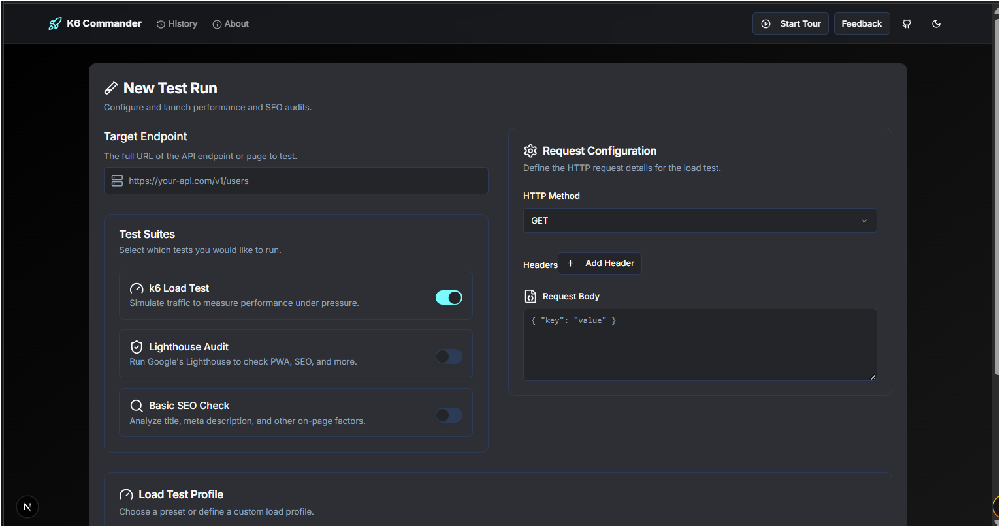

# K6 Commander

K6 Commander is a lightweight, local-first, authorized load-testing platform. It allows you to configure, run, and analyze load tests, Lighthouse audits, and basic SEO checks directly from a sleek web UI, leveraging the power of k6, InfluxDB, and Grafana.

**Disclaimer:** This tool is intended for performance testing **your own applications** where you have explicit permission to do so. Unauthorized testing of third-party websites is illegal and unethical. The creators of this software are not responsible for its misuse.



## ✨ Features

- **Multi-Modal Testing**: Run k6 load tests, Google Lighthouse audits, and basic on-page SEO checks from a single interface.
- **Web-Based Configuration**: Easily configure load tests (URL, method, headers, body, VUs, stages) through an intuitive UI.
- **Test Presets**: Get started quickly with presets for Baseline, Spike, Stress, and Soak tests.
- **Live Monitoring**: View real-time test metrics in a pre-configured Grafana dashboard.
- **Unified Summary Reports**: Get a detailed, tabbed report with charts and scores after each test run.
- **Local History**: All test configurations and results are stored in your browser's LocalStorage. No cloud database needed.
- **Import/Export**: Easily back up and share your test history as a JSON file.
- **Self-Hosted & Containerized**: Runs entirely on your local machine with Docker Compose for consistency and scalability.

## 🛠️ Stack

- **Frontend:** Next.js 14 (App Router), TypeScript, Tailwind CSS, shadcn/ui
- **Backend API:** Next.js Route Handlers
- **Test Runner:** [k6](https://k6.io/) (via Docker)
- **Audit Engine:** [Google Lighthouse](https://developers.google.com/web/tools/lighthouse) (via `npx`)
- **Metrics Database:** InfluxDB 1.8
- **Dashboards:** Grafana
- **Orchestration:** Docker Compose

## 🚀 Getting Started

### Prerequisites

- [Docker](https://www.docker.com/get-started) and [Docker Compose](https://docs.docker.com/compose/install/)
- Node.js (for package management if you wish to modify the code)
- A web browser (Chrome, Firefox, etc.)

### 1. Clone the Repository

```bash
git clone https://github.com/your-username/k6-commander.git
cd k6-commander
```

### 2. Build and Run with Docker Compose

From the root directory of the project, run:

```bash
docker-compose up --build
```

This command will:
1.  Build the Next.js application's Docker image.
2.  Pull the required images for InfluxDB and Grafana.
3.  Start all services (`app`, `influxdb`, `grafana`).

Once the services are up, you can access:

- **K6 Commander UI**: [http://localhost:3000](http://localhost:3000)
- **Grafana Dashboard**: [http://localhost:3003](http://localhost:3003)
  - Login with default credentials: `admin` / `admin`. You will be prompted to change the password on first login.

### 3. Running Your First Test

1.  Navigate to [http://localhost:3000](http://localhost:3000).
2.  Accept the terms of service.
3.  Fill in the "New Test Run" form with the URL you want to audit.
4.  Select the test suites to run (Load Test, Lighthouse, SEO).
5.  If running a load test, choose a preset or configure it manually.
6.  Click "Run Test(s)".
7.  Monitor the "Test Running" view. For load tests, a link to the live Grafana dashboard will be available.
8.  Once the test is complete, a summary report will be displayed.

## 📁 Project Structure

```
/
├── .github/          # GitHub templates (issues, funding)
├── grafana/          # Grafana provisioning files
│   ├── dashboards/     # Pre-configured dashboard JSON
│   └── provisioning/   # Datasource and dashboard configurations
├── k6/               # k6 test scripts
│   └── script.js     # The main k6 script, configurable via environment variables
├── public/           # Static assets for Next.js
├── results/          # (Git-ignored) Directory where test outputs are saved
├── src/
│   ├── app/            # Next.js App Router
│   │   ├── (pages)/    # Main application pages (form, history, etc.)
│   │   ├── api/        # API route handlers for running tests
│   │   └── layout.tsx  # Root layout
│   ├── components/     # React components
│   │   ├── layout/     # Header, Footer, etc.
│   │   ├── pages/      # Components specific to a single page
│   │   ├── test/       # Components for the test lifecycle (form, running, summary)
│   │   └── ui/         # Reusable shadcn/ui components
│   ├── hooks/          # Custom React hooks
│   ├── lib/            # Utility functions and constants
│   └── types/          # TypeScript type definitions
├── docker-compose.yml  # Orchestrates all services (app, grafana, influxdb)
├── Dockerfile          # Defines the Next.js application container
├── next.config.ts      # Next.js configuration
└── package.json        # Project dependencies and scripts
```

## ⚙️ Configuration

The primary configuration is handled within `docker-compose.yml` and the Next.js application itself. There is no need for a `.env` file for basic operation.

### k6 Script Environment Variables

The core k6 test script (`k6/script.js`) is dynamically configured by the Next.js backend via environment variables passed to the Docker container at runtime. These are sourced from the user's input in the web UI.

- `TARGET_URL`: The URL to test.
- `HTTP_METHOD`: `GET`, `POST`, etc.
- `HEADERS_JSON`: A JSON string of request headers.
- `BODY`: The request body content.
- `STAGES_JSON`: A JSON string defining the ramping stages for VUs.
- `VUS`: The number of virtual users for a fixed test.
- `DURATION`: The duration for a fixed test.

### Service Configuration

- **Grafana**: The admin user/password can be changed in `docker-compose.yml` under the `grafana` service's environment section.
- **InfluxDB**: The database name (`k6`) is set in `docker-compose.yml`.

## 🤝 Contributing

Contributions, issues, and feature requests are welcome! Feel free to check the [issues page](https://github.com/your-username/k6-commander/issues).

Please read our [Contributing Guidelines](./CONTRIBUTING.md) and [Code of Conduct](./CODE_OF_CONDUCT.md).

## 📜 License

This project is licensed under the MIT License - see the [LICENSE](./LICENSE) file for details.
